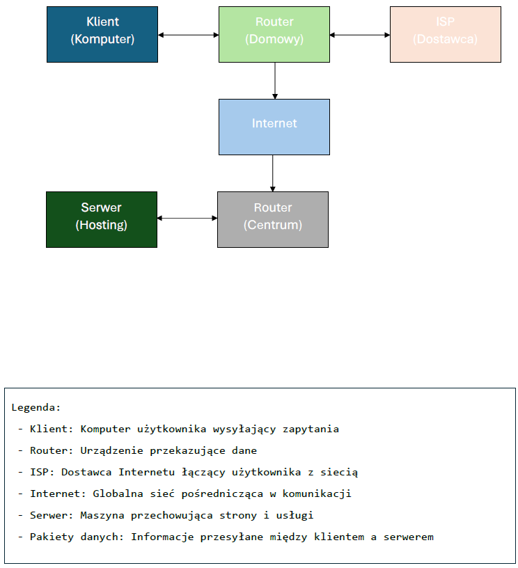

# RaccoonFrontend

## Uproszczony schemat działania sieci:

### Pojęcia:

**ISP (Internet Service Provider) – Dostawca usług internetowych**

To firma, która zapewnia użytkownikom dostęp do Internetu. ISP może oferować różne 
rodzaje połączeń, np. światłowodowe, kablowe, mobilne (LTE, 5G) czy satelitarne. 
Przykłady dostawców to Orange, T-Mobile, UPC.

**Router:**

To urządzenie sieciowe, które zarządza ruchem internetowym w sieci lokalnej i 
przekazuje dane między urządzeniami (komputerami, telefonami) a Internetem. 
Router często pełni też funkcję punktu dostępu Wi-Fi, umożliwiając bezprzewodowe 
połączenie z siecią.

**Pakiet danych:**

Podstawowa jednostka transmisji danych w sieciach komputerowych. Dane wysyłane 
przez Internet są dzielone na mniejsze fragmenty – pakiety, które zawierają:
- nagłówek (adresy nadawcy i odbiorcy, informacje kontrolne),
- ładunek (właściwa treść, np. fragment strony internetowej).
Pakiety mogą podróżować różnymi trasami, a na końcu są składane w całość.

**Serwer:**

To komputer lub system, który przechowuje i udostępnia zasoby innym urządzeniom 
w sieci. Serwery mogą obsługiwać strony WWW, pocztę e-mail, pliki czy bazy danych. 
Przykładowo, gdy odwiedzasz stronę internetową, Twój komputer łączy się z serwerem, 
który przesyła pliki strony do Twojej przeglądarki.

**Klient:**

To urządzenie lub oprogramowanie, które wysyła zapytania do serwera i odbiera od 
niego odpowiedzi. Przykłady klientów to:
- przeglądarka internetowa (klient HTTP) – pobiera strony WWW,
- program pocztowy (klient e-mail) – pobiera wiadomości e-mail z serwera,
- aplikacja mobilna łącząca się z bazą danych.

W komunikacji sieciowej klient i serwer współpracują – klient wysyła żądanie, a 
serwer odpowiada, dostarczając żądane dane.

## Nagłówki żądań (Request Headers) i ich przeznaczenie:

1. `User-Agent` – identyfikuje przeglądarkę i system operacyjny użytkownika. Wartość:
   `Mozilla/5.0 (X11; Linux aarch64) AppleWebKit/537.36 (KHTML, like Gecko) Chrome/134.0.0.0 Safari/537.36 CrKey/1.54.250320`
   serwer może na tej podstawie dostosować treść strony (np. wersja mobilna lub desktopowa).

2. `Accept` – informuje serwer, jakie typy treści klient akceptuje. Wartość:
   `text/html,application/xhtml+xml,application/xml;q=0.9,image/avif,image/webp,image/apng,*/*;q=0.8,application/signed-exchange;v=b3;q=0.7`
   oznacza, że przeglądarka preferuje format HTML, ale obsługuje też obrazy WebP i AVIF.

3. `Cookie` – zawiera dane sesyjne i identyfikatory użytkownika przechowywane w plikach cookie. Serwer może wykorzystać je do personalizacji treści lub uwierzytelniania.

## Nagłówki odpowiedzi (Response Headers) i ich przeznaczenie:

1. `Cache-Control` – określa, jak długo treść może być przechowywana w pamięci podręcznej. Wartość:
   `public, max-age=31536000`
   oznacza, że zasób może być buforowany przez rok (31 536 000 sekund).

2. `Content-Encoding` – informuje, czy odpowiedź została skompresowana. Wartość:
   `gzip`
   oznacza, że serwer skompresował treść, aby przyspieszyć ładowanie strony.

3. `Vary` – wskazuje, że treść może się różnić w zależności od nagłówka Accept-Encoding. Wartość:
   `Accept-Encoding`
   dzięki temu serwer może dostosować odpowiedź do formatu obsługiwanego przez klienta.

